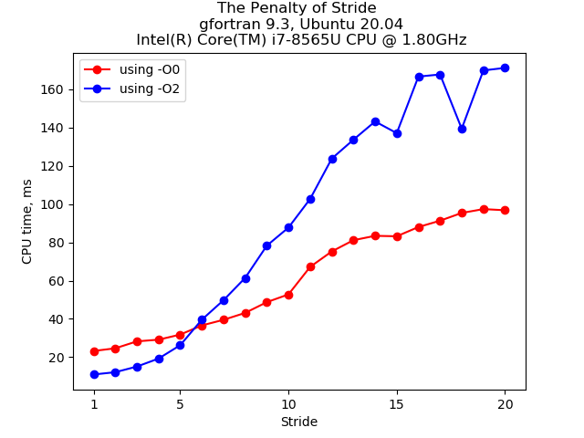
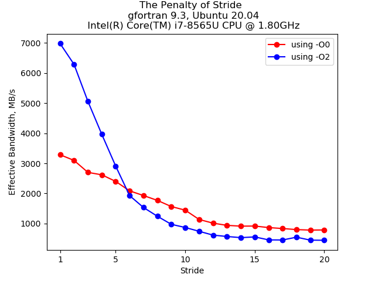
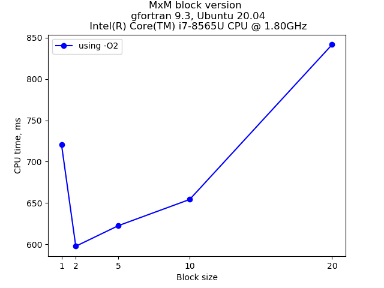
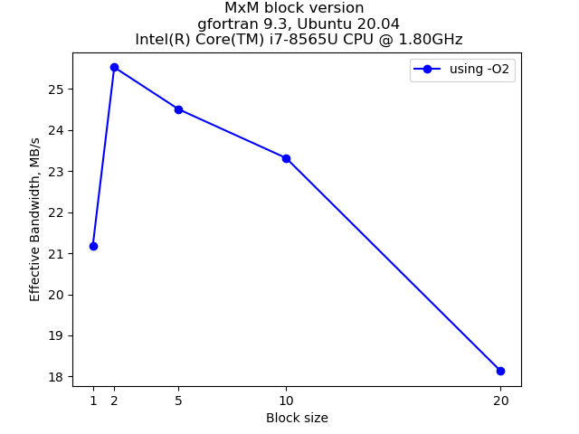

### Exercise 1:

=- We compile the ```stride.c``` code with all optimization and vectorization disabled (-O0) and we run it for different strides
- We do the same thing, with (-O2) that activates some optimizations
- What is the conclusion?

- Expected output (Not necessary the same result):






### Exercise 2:

- Compile and run ```mxm_bloc.c``` for bloc matrix multiplication using the block version

- Compute the cpu time and bandwith for different block size, which block size is the optimal one ? Why ?

- Expected output (Not necessary the same result):




